## Contents
- [Project overview](#project)
- [Choice of Tech Stack](#techstack)
- [Version Control](#versioncontrol)
- [Installation Guide](#installation)
- [Technical Errors](#errors)
- [Project Plan](#plan)
- [User Journey](#journey)
- [Legal and Ethical](#legal)
- [Future Plans](#future)
- [References](#references)

# Project Overview

The project is a website to display useful tools to assist with web development. This is a community-based webpage where users can interact with other and the content itself to expand the toolset. This will be available to users with both basic and advanced experience with web development, enhancing the users' experience using this website.

# Choice of Tech Stack

My choice of the tech stack for this project includes: JavaScript, MySQL, and Azure.

- JavaScript has been used within my website for the front-end interactive features, including my pop-up menus as well as the transfer of data to enable the user to alter the profile picture in the Account.html.

- MySQL will be the database for collecting data inputted by the user such as user PII, login details, live feeds for the forum side (once it is implemented).

- Azure will be the server host for the website once it is live. Although I have had some issues with hosting the server which I am working on, so the website is running on a local server. This is a temporary substitute until the issues are resolved. All of the assets such as images are stored locally so the website demo can be viewed appropriately.

# Version Control

I have ensured that with any major update to use Git to push and sync to GitHub. I had started this project through a separate repository to ensure there was a backup in case of technical issues or corruption.

Here is a link to the GitHub Repo:
https://github.com/CS-LTU/com4113-tech-stack-summative-assessment-RedcoatGWW.git

# Installation Guide

Here is a step-by-step guide on how to set up the development environment. This project was developed using Visual Studio Code (VSC) and will be required as well as installing the Live Server extension as the only software prerequisite for this project.

There is a potential error where if the user attempts to open this directly through GitHub, due to the local files, this may end up corrupting the page leading to blank pages, image files not loading or even the format corruption. To ensure that doesnt happen, the guide below is required to be followed for the current version of the Demo.
### Step 1:
Open VSC and create a new instance.

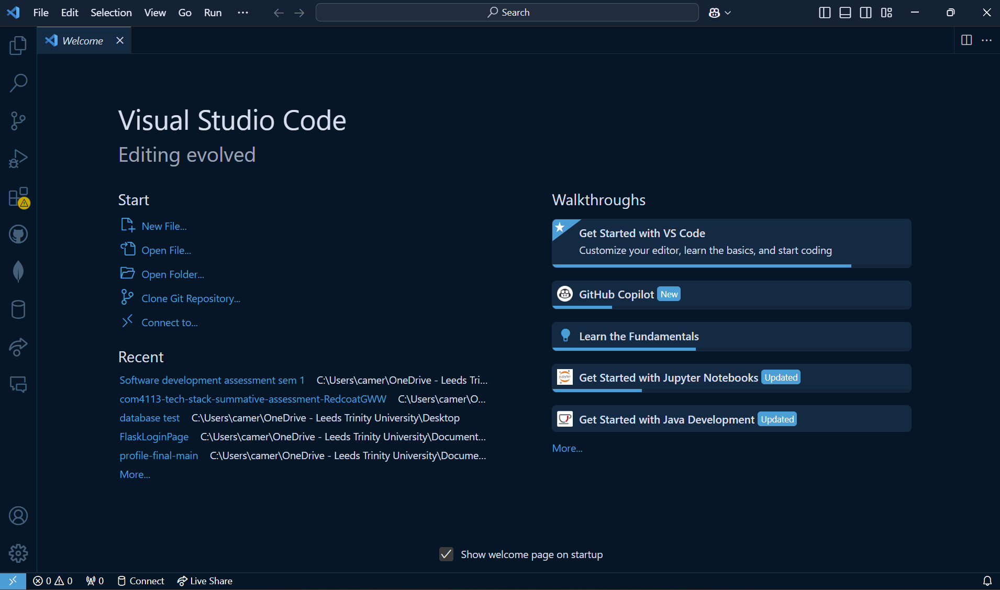

### Step 2:
Navigate to https://github.com/CS-LTU/com4113-tech-stack-summative-assessment-RedcoatGWW.git and click on code then the copy to clipboard button next to the GitHub link.

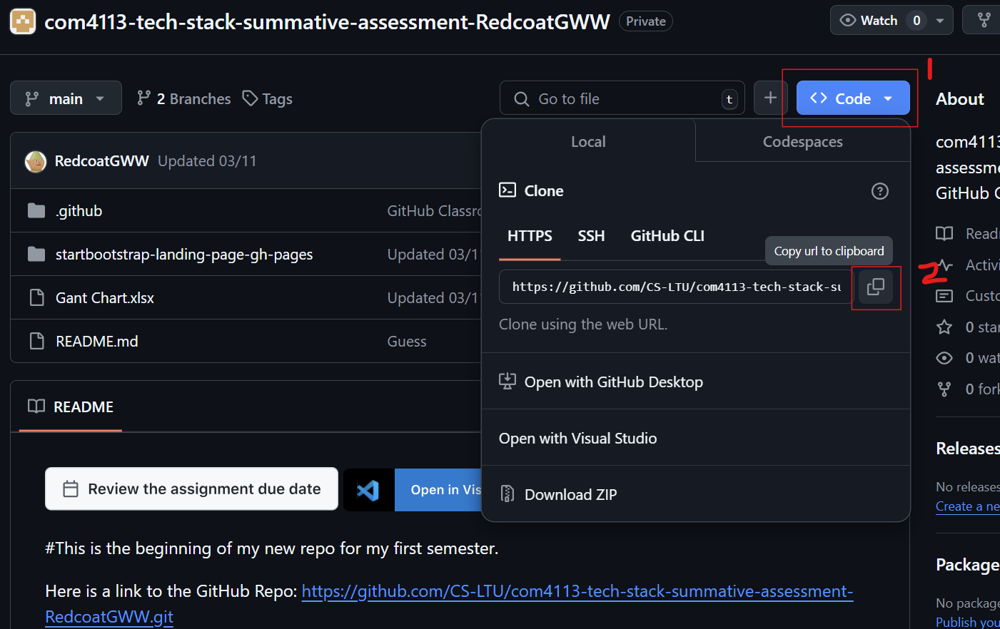

### Step 3:
In VSC, clone the repository and paste the GitHub link into the bar above.
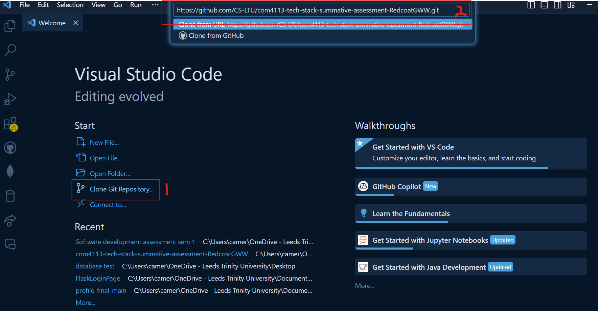

### Step 4:
In VSC under the extensions tab, install the Live Server extension. This will allow you to view the website from a local server.

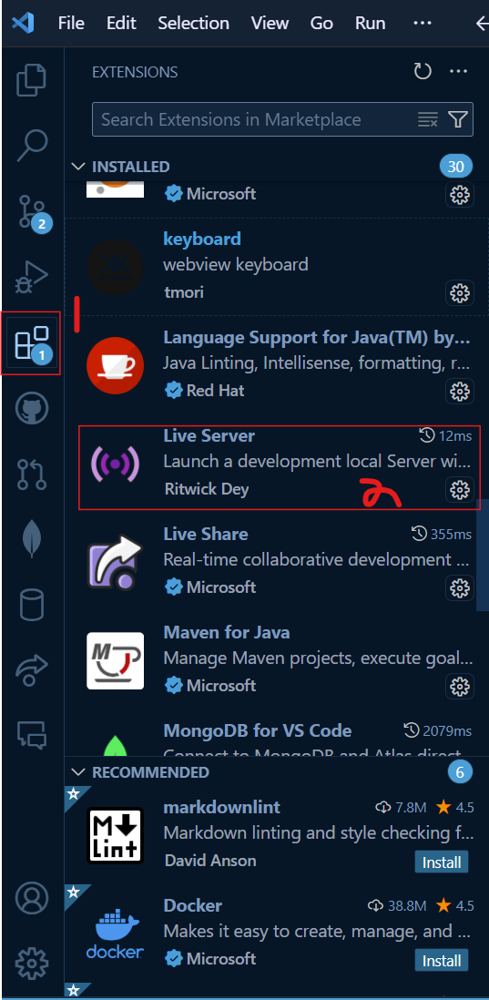

### Step 5:
Whilst on the index.HTML page, launch the live server in the bottom right.
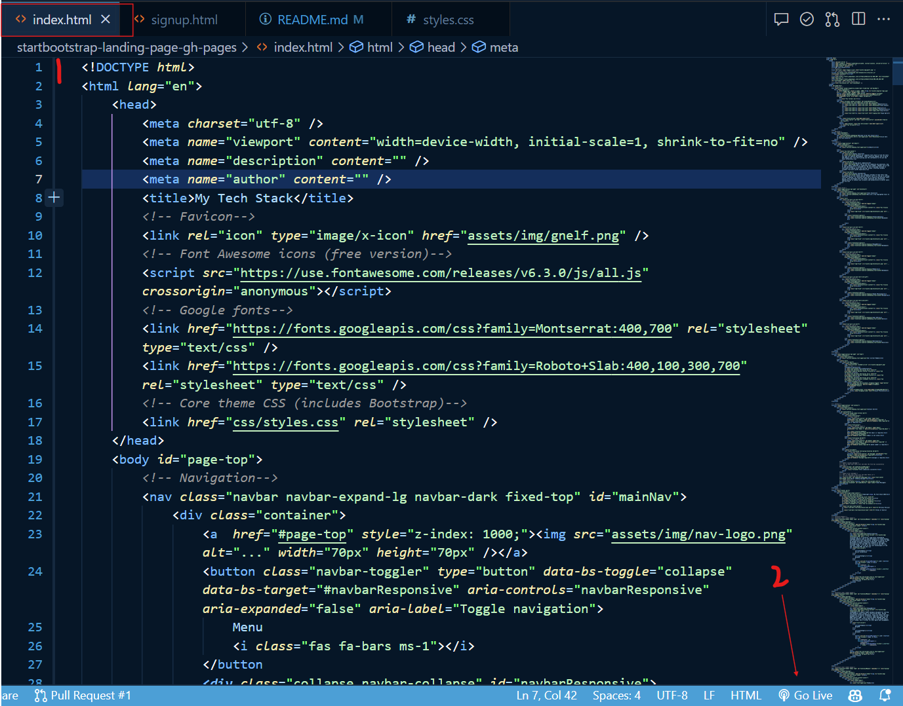

### Step 6:
The website will launch on your preferred browser.

### Technical errors

The main trouble that I have faced is mainly through using Bootstrap. As this is my first time i have used this, I spent most of my time learning the structure of how the template was built. After adding the additions to my navigation bar, it seemed that the template for the mobile version had become warped. This was due to the styling I used for my custom logo as I was using 'px' instead of '%' for the styling.

I spent a lot of time working on spacings between my headers and the navigation bar as they were placed very close to one another. We had previously learned that (for example) 'margin-top' allows you to increase the space above the container you are editing. Bootstrap, on the other hand, uses an abbreviated term for these such as 'mt-3' which adjusts the container at a preset variable.
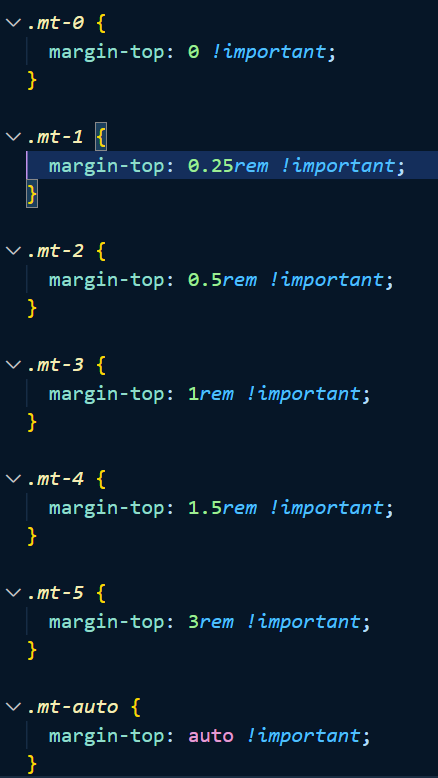

I have had some styling issues with one of the containers where using a similar format for a form make it unable to style correctly. This page will need to be reconstructed in order for the styling to set properly.
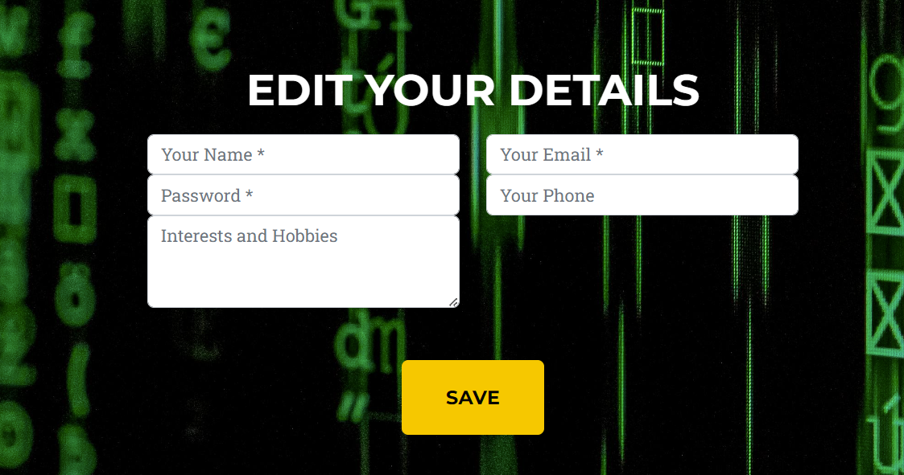

During bug testing, I received an error in my CSS for ``-webkit-appearance: textfield;``, This occurs twice throughout. This is a non-standard way of styling, used for older versions of browsers such as Safari, Firefox, and Edge. However, despite the error, no visual issues occurred, so I have left this in to avoid causing any potential conflicts that might occur from disabling it.

# Project plan

I created my Gantt Chart early on in the development to give myself an idea as to how long I was looking at spending on each section. As far as the time-keeping side of it all, I have had large bursts of productivity later on in the timeline due to bursts of inspiration and clarity on the direction of the project.

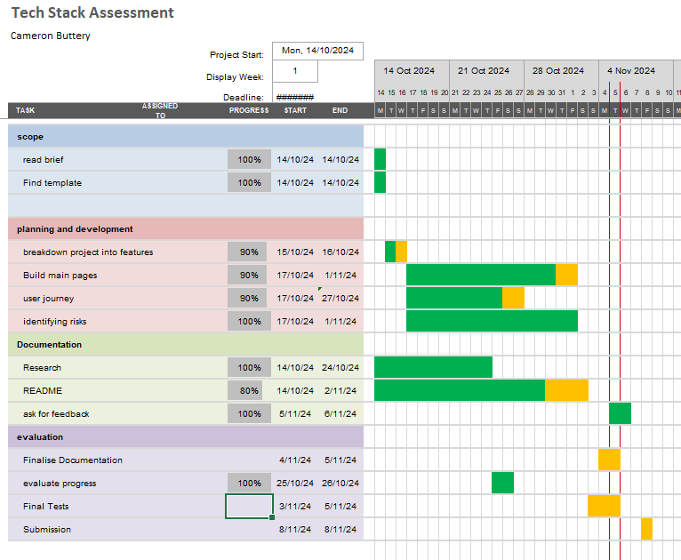

## User Journey

For my user journey, I wanted the website to feel comfortable and easy to navigate. On the landing page, I have designed multiple ways to access content easily, using either the navigation bar or the search bar. I have also ensured that the different sections have bold headers, allowing users to identify them at a glance.

I have included six pop-up modals so users can get a glimpse of the content within the website without needing to sign up. This feature draws users in by showcasing available content before they commit to creating an account.

The sign-up and log-in sections are minimalistic and compact, so users aren’t overwhelmed or bombarded with information. Links to the terms and conditions are available at the bottom for those who wish to review them. Once signed in, users are routed back to the main page, where they gain access to new options, such as editing their profile picture (selected in the sign-up form), changing their password, and reviewing previously entered information.

#### Below is a visual representation of the user's journey through the current live demo.

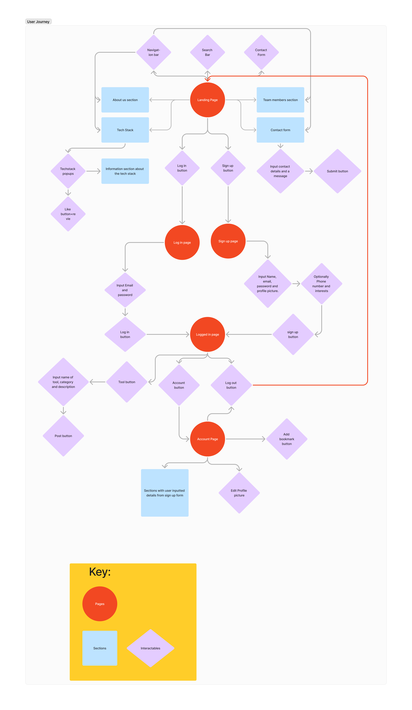

# Legal and ethical considerations

### GDPR
To ensure compliance with GDPR, this project demo is currently hosted on a secure local server. As the project progresses, I will ensure that any server provider I use fully adheres to the GDPR Data Protection Act 2018. For user transparency, all data handling practices will be clearly outlined in the terms and conditions, so users understand exactly what information they’re sharing when creating an account. Overall, data collection will be minimized for user protection, and only optional information that users willingly provide—such as hobbies and mutual interests—will be included. The sensitive data provided by the user for account creation will only be held for up to 6 months of no activity before they are notified that their data will be cleared for their protection. This will ensure that if a user no longer requires the services of the website, their data will be safely removed from the servers.

### Copyright and Trademarks
Considering that the website is intended as a guide to help users find external resources, including some that may feature copyrighted or trademarked content, proper crediting is essential. To align with these requirements, I have included source company names within the tech stack, ensuring users understand the origins of each tool. Further research will be conducted to fully understand the legal limitations and restrictions involved in creating a tool compilation website, so that all content is compliant with copyright and trademark regulations.

In the image below you can see the company credited below the description of the tool.
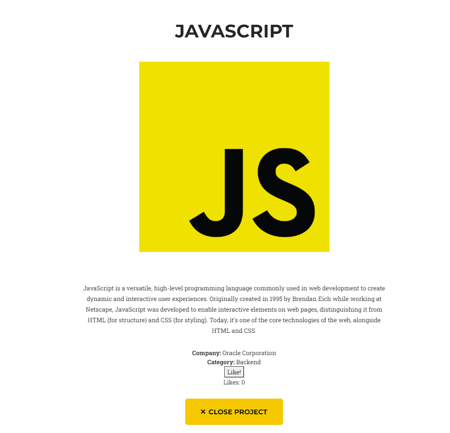

### Moderation
Since this is a community-driven website that relies on user contributions to grow, moderation of comments and linked tools will be essential. In the future, implementing an AI-powered moderation tool, such as (UserWay, 2024) could be beneficial. This type of tool is specifically designed to detect and filter out racist, biased, and socially unacceptable language, helping to maintain a safe environment for all users. Additionally, for any files being uploaded by users, a screening system would also prove of use for any malicious data mining tool being used to breach users data.

## Future Plans

My goal is to expand the website into a forum-like platform where users can explore a variety of tools categorized by type and functionality. Each tool will feature links to relevant resources, user reviews, and ratings to help others make informed decisions. This will encourage a sense of community, allowing users to share insights, ask questions, and provide feedback on different tools, ultimately creating collaborative space for learning and discovery.

### References

- Bootstrap. (2024). https://getbootstrap.com
- JavaScript. (2024). https://www.javascript.com
- MongoDB. (2024). https://www.mongodb.com
- MySQL. (2024). https://www.mysql.com
- Adobe. (2024). https://www.adobe.com/products/photoshop.html
- OpenAI. (2024). https://openai.com/index/chatgpt/
- Battleye. (2024). https://www.battleye.com
- Data Protection Act 2018 (c.12) London: HMSO. https://www.legislation.gov.uk/ukpga/2018/12/contents/enacted
- Userway. (2024). https://userway.org/moderator/

#Section 2

## Error handelling

### Uploading Images
I have been experienceing issues when attempting to upload images from my initial sign up form. I believe that the issue is to do with the server communicating with the 'Uploads' folder where the images are held. As you can see from the image below. From the 'Sign-up' form, the files are being sent to the server however they aren't being displayed despite the upload file being defined.
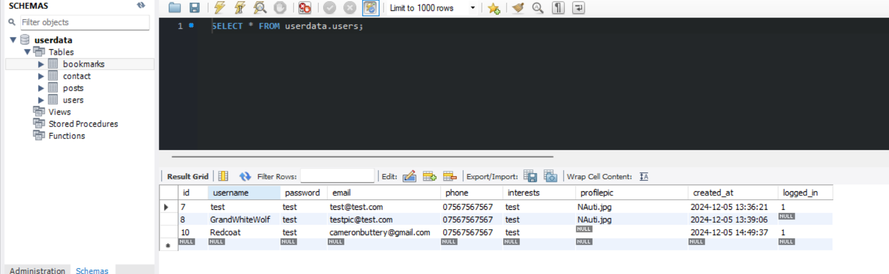

This can potentially be fixed by reformatting the upload form and moving it out of the 'static' folder, however, that would clutter the organisation of the web_domain parent folder. As for now this feature isnt working.

### Delete account function
I have attempted to create a button that would allow the user to delete their account from the server. However i am unable to get the button from the HTML side to communicate with a App.py side. I attempted to use a stored procedure which would allow the function to be constant and able to be called at any time. This did not fix the issue.
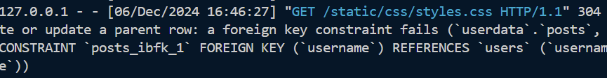

After writing this top paragraph i reattempted by researching further into stored procedures and found that the way i was calling the tables was causing issues. As MySQL works on a ordered basis, i had to ensure that the child tables where being called before the parent. This has resolved the issue. The MySQL code below is my PRC and is also displayed as a company standard with modification history attatched.

<!-- CREATE DEFINER=`root`@`localhost` PROCEDURE `prc_delete_user`(IN username VARCHAR(255))
BEGIN
    /*
    Author: Cameron
    Date Created: 06/12/2024
    Description: Allows users to delete their information from the server

    Modification History:
    MODIFIED BY     ON DATE     MODIFICATION
    */
    
    -- Delete posts related to users with the given username
    DELETE FROM posts
    WHERE username = username;

    -- Delete users with the given username
    DELETE FROM users 
    WHERE username = username;

END -->

## Entity Relationship Diagram

Below is my ERD that shows which of my forms are connected. And how they pull data for one another. The Key factor from them is that it takes the username for the Session ID so the server knows which user it is communicating with. The only table not connected is the contact form as the intention for this is to be for the use of everyone even if the user doesnt have an account. 
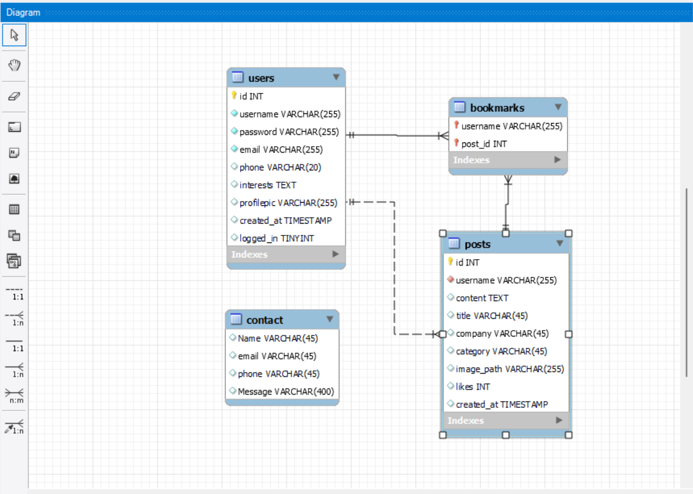

